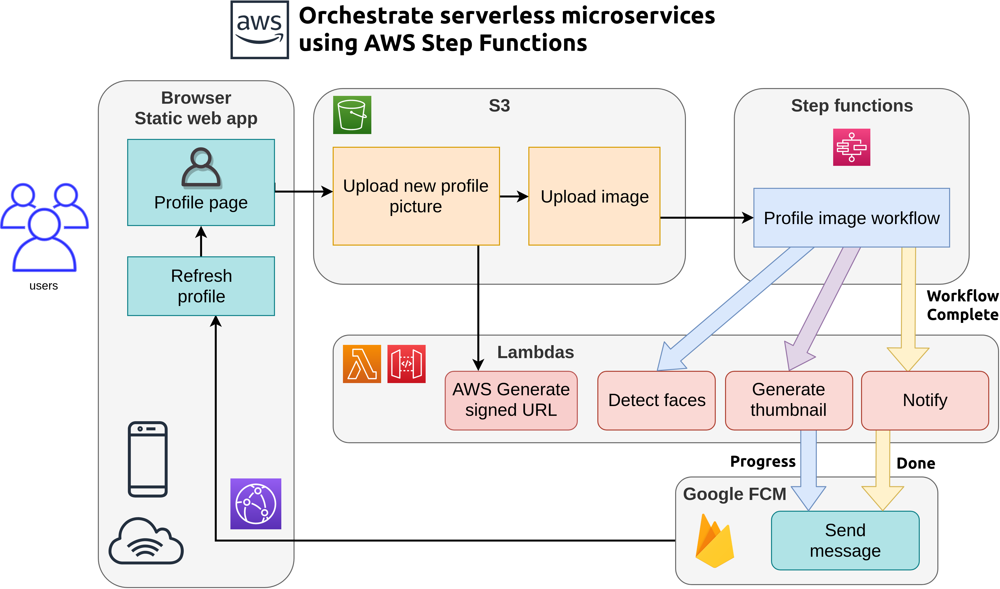
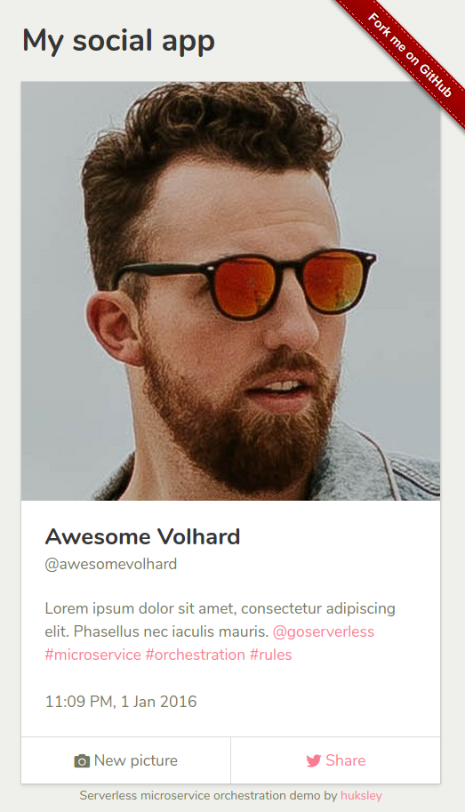

# Profile form

Demo social network profile page with face and smile recognition. Built on AWS Rekognition with serverless orchestration using AWS Step Functions.

Asynchronious notification handled by Google Cloud Messaging.

## Architecture

## Components

- [aws-profile-form](https://github.com/huksley/aws-profile-form/) This static webapp for uploading profile pictures.
- [aws-detect-faces-function](https://github.com/huksley/aws-detect-faces-function/) AWS Lambda to detect face
- [aws-resize-function](https://github.com/huksley/aws-resize-function/) Resizes and crops to face using NodeJS sharp library
- [aws-upload-handler](https://github.com/huksley/aws-upload-handler/) Creates presigned form URLs for image upload
- [aws-messaging](https://github.com/huksley/aws-messaging/) Handles async messaging and data updates via Google FCM
- [aws-s3-listener](https://github.com/huksley/aws-s3-listener/) Listens to S3 image uploads and fires AWS Step Functions workflow
- aws-detect-faces-workflow TBA. Workflow for step functions and monitoring.

## Preview

## Links

- https://couds.github.io/react-bulma-components/
- https://alligator.io/react/intro-react-bulma-components/
- https://bulma.io/documentation/customize/with-webpack/
- https://aws-amplify.github.io/docs/cli/init?sdk=js
- https://codeburst.io/react-image-upload-with-kittens-cc96430eaece
- https://blog.webiny.com/upload-files-to-aws-s3-using-pre-signed-post-data-and-a-lambda-function-7a9fb06d56c1
- https://medium.com/@ashan.fernando/upload-files-to-aws-s3-using-signed-urls-fa0a0cf489db
- https://github.com/firebase/quickstart-js/blob/master/messaging/firebase-messaging-sw.js
- http://craig-russell.co.uk/2016/01/29/service-worker-messaging.html

## Licenses & attribution

Code licenced under MIT

Images from https://unsplash.com/

Favicon by freepik [Watercolor vector created by freepik - www.freepik.com](https://www.freepik.com/free-photos-vectors/watercolor)
